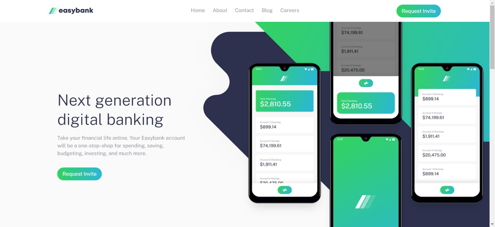

# EasyBank Landing Page



🚀 Exciting News Alert! 🚀

I am thrilled to announce the completion of my latest project, a modern landing page for EasyBank, crafted with passion and powered by React.js, Tailwind CSS, and Framer Motion! 🌟✨

## Project Details

- **Challenge:** Frontend Mentor Challenge Accomplished!
- **Project:** EasyBank Landing Page
- **Tech Stack:** React.js, Tailwind CSS, Framer Motion

## Project Highlights

- **Sleek Design:** A visually appealing and modern design that captures the essence of EasyBank's brand.
- **Seamless Interactions:** Utilized Framer Motion for smooth animations and interactive user experience.
- **Responsive:** Ensured the landing page is fully responsive, providing a seamless experience across all devices.
- **User-Friendly:** Focus on creating an intuitive interface for effortless navigation.

## Acknowledgments

Massive thanks to the amazing Frontend Mentor community for the constant support and inspiration! 🙌 Let's keep pushing boundaries and creating exceptional digital experiences. 🚀

## Get Started

1. **Clone the repository:**

   ```
   git clone (https://github.com/KamalJoshi-web/easybank.git)
   ```

2. **Install dependencies:**

   ```
   npm install
   ```

3. **Run the application:**

   ```
   npm start
   ```

## Contributing

Contributions are welcome! Feel free to open an issue or submit a pull request.
